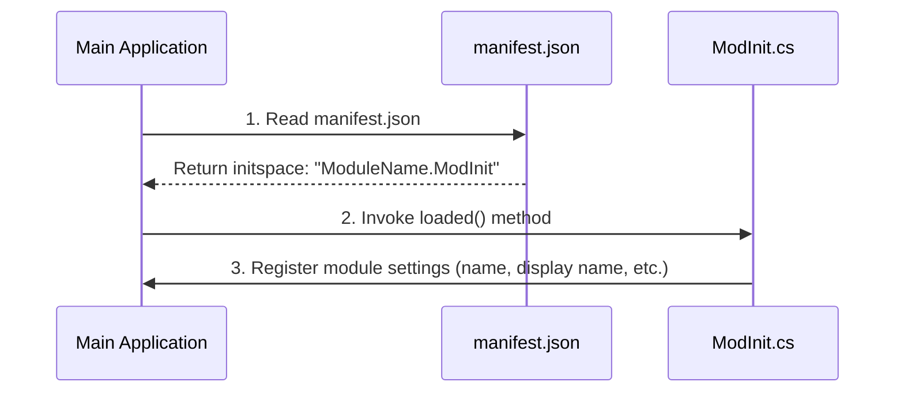
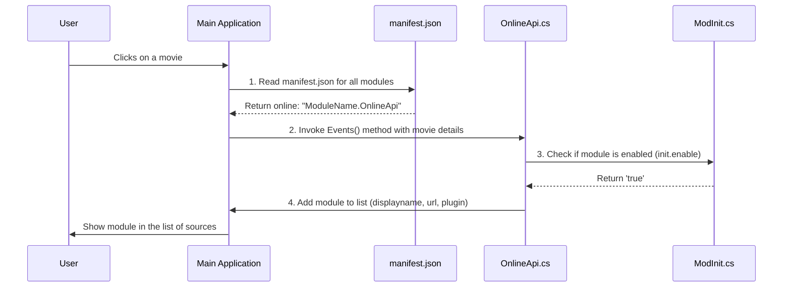
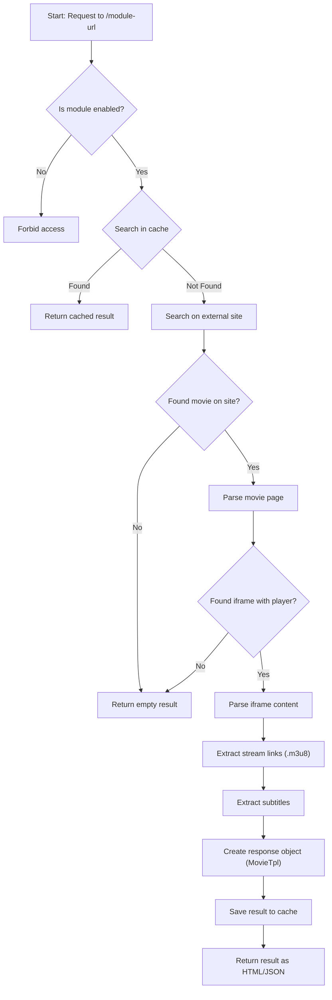

# Lampac Online Module Architecture

This document provides a generalized overview of the structure, initialization, and operation of an online module for the Lampac platform. It is based on the `Uaflix` module and is intended to serve as a template for creating new modules.

## 1. File Structure

A typical online module consists of the following key files:

-   **`manifest.json`**: The module's "passport". It tells the main application how to load and initialize the module.
-   **`ModInit.cs`**: The module initializer. This code runs once when the module is loaded to set up initial configurations.
-   **`OnlineApi.cs`**: The "bridge" to the main application. It allows the module to register itself as an available online source.
-   **`Controller.cs`**: The "heart" of the module. It handles requests from the main application, fetches data from the external source, parses it, and returns the results.
-   **`Models/`**: A directory containing data model classes used internally to structure information (e.g., `Movie`, `Result`).
-   **`*.csproj`**: The C# project file that defines dependencies and build settings.

## 2. Module Lifecycle

The module's lifecycle can be broken down into three main stages: Initialization, Integration, and Operation.

### 2.1. Initialization

This is the first step where the module comes to life.

1.  **Read `manifest.json`**: On startup, the main application scans for modules and reads their `manifest.json` files. It looks for the `"initspace"` key to identify the initialization class.
2.  **Invoke `loaded()`**: The application then calls the static `loaded()` method in the specified class (e.g., `ModInit.cs`).
3.  **Register Module**: Inside `loaded()`, an `OnlinesSettings` object is created, defining the module's internal name, display name, and other parameters. This configuration is stored in a static variable, making it accessible to other parts of the module.

### 2.2. Integration

This stage makes the module visible to the user.

1.  **Read `manifest.json`**: When a user selects content, the application again reads `manifest.json`, this time looking for the `"online"` key to find the integration class (e.g., `OnlineApi.cs`).
2.  **Invoke `Events()`**: The application calls the `Events()` method from the specified class, passing in details about the selected content.
3.  **Check Status**: The `Events()` method checks if the module is enabled by accessing the settings object created during initialization (`ModInit.ModuleName.enable`).
4.  **Add to List**: If enabled, the module adds its details (display name, request URL) to the list of available sources, which is then presented to the user.

### 2.3. Operation (Controller Logic)

This is the main workflow that executes when the user selects the module as a source.

1.  **Request & Validation**: The `Controller` receives an HTTP request at its designated URL (e.g., `/uaflix`). It first validates that the module is enabled.
2.  **Caching**: It checks a local cache (`hybridCache`) for a previously saved result to avoid redundant work.
3.  **External Search**: If no cached data exists, it performs a search on the external website.
4.  **Parsing**: It parses the HTML of the search results and the movie page to find `<iframe>` elements containing video players.
5.  **Stream Extraction**: It loads the content of each `<iframe>` and parses its internal HTML/JavaScript to find direct links to video streams (`.m3u8` files) and subtitles.
6.  **Response Formatting**: All collected data (streams, quality, translations, subtitles) is packaged into a standardized template object (`MovieTpl`).
7.  **Caching & Return**: The final result is saved to the cache and then returned to the main application as either HTML or JSON.
## 3. Common Compilation Errors and Solutions

This section covers common C# compilation errors that may occur during module development and provides standardized solutions based on fixes implemented in the `Uaflix` module.

### `CS1002`: Semicolon expected

-   **Problem**: A statement is missing a terminating semicolon (`;`).
-   **Solution**: Review the line indicated in the error and add a semicolon at the end of the statement.

### `CS1513`: } expected

-   **Problem**: A code block is missing a closing curly brace (`}`).
-   **Solution**: Ensure that all methods, classes, and control structures (e.g., `if`, `foreach`) have a matching closing brace.

### `CS0136`: A local variable named 'X' cannot be declared in this scope...

-   **Problem**: A variable is re-declared within a nested scope where a variable with the same name already exists in an outer scope. This was observed in `foreach` loops inside the `ParseAllZetvideoSources` and `ParseAllAshdiSources` methods.
-   **Solution**: Rename the variable in the inner scope to make it unique. For example, change `var text` to `var scriptText`.

### `CS0103`: The name 'X' does not exist in the current context

-   **Problem**: A variable is used outside of the scope in which it was declared. This occurred with the `episodeMovies` variable, which was declared inside an `if` block but used in a subsequent `else` block.
-   **Solution**: Declare the variable in a higher scope that is accessible to all code blocks where it is used. For instance, declare `List<Movie> episodeMovies;` before the `if`/`else` structure.